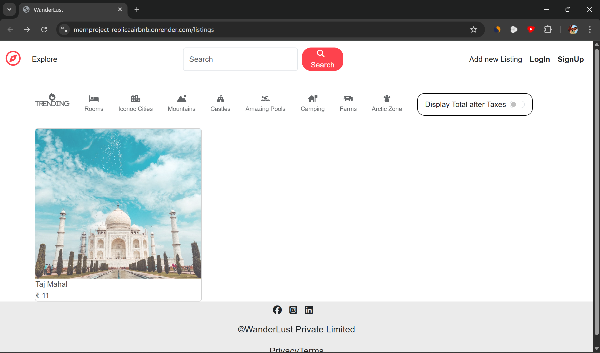
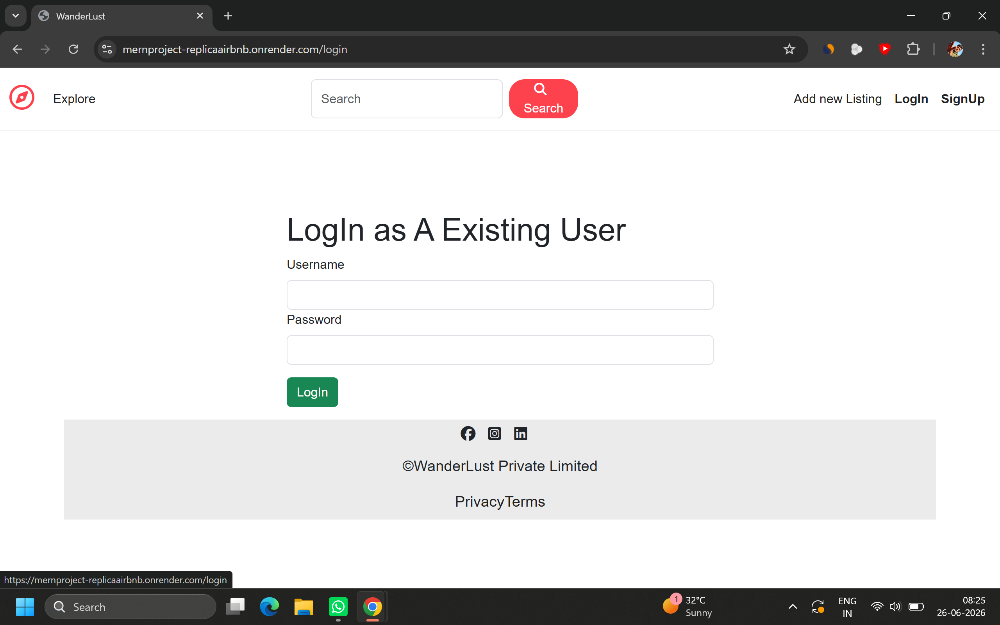
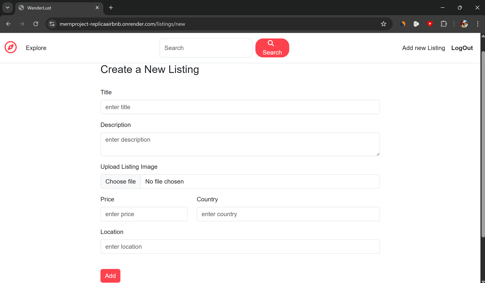
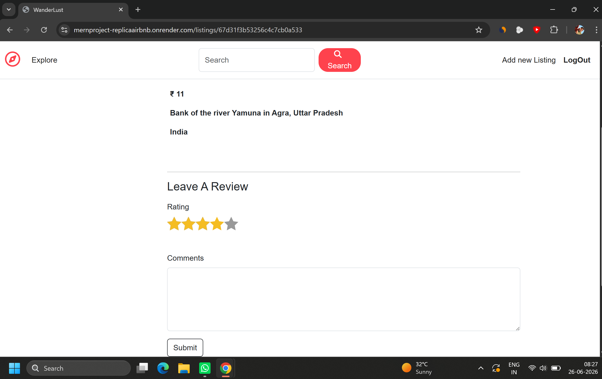

# Airbnb Clone (MERN)

Full-stack property rental platform.

## Features
- Authentication
- Create listing
- Edit/Delete listing
- Cloud image upload
- Booking flow
- Review/Share Experience

## Tech Stack
MongoDB
Express
Node
Cloudinary

## Screenshots

### Home


### Login


### Add New Listing


### Review



## Installation

Clone the repository

```bash
git clone https://github.com/YOUR_USERNAME/AirBNB_Replica_MernProject.git
```

Move into project directory

```bash
cd AirBNB_Replica_MernProject
```

Install dependencies

```bash
npm install
```

Start the application

```bash
npm start
```

Open browser:

```text
http://localhost:3000
```

---

## Challenges Solved

- Designed RESTful APIs for property and booking management
- Integrated Cloudinary for image storage and optimization
- Managed authentication and authorization flow
- Handled CRUD operations for listings
- Structured backend routes for scalability

---

## Future Improvements

- Payment gateway integration
- Advanced property search and filters
- Wishlist / Favorites feature
- Notifications and email alerts
- Better responsive UI
- Booking analytics dashboard
- Performance optimization
